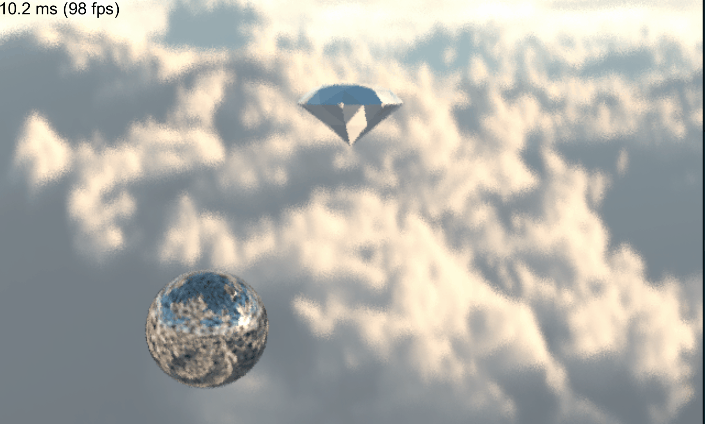

# RayTracingScene
Add some other feature base on fallingcat's ComputeRayTracingSamples

# Implement Features
- Can load low poly obj file
- Envirenment mapping
- Ray-Triangle and Ray-Sphere intersection
- Procedural texture (Perlin Noise)
- Simple AABB accerleration

## Samples

